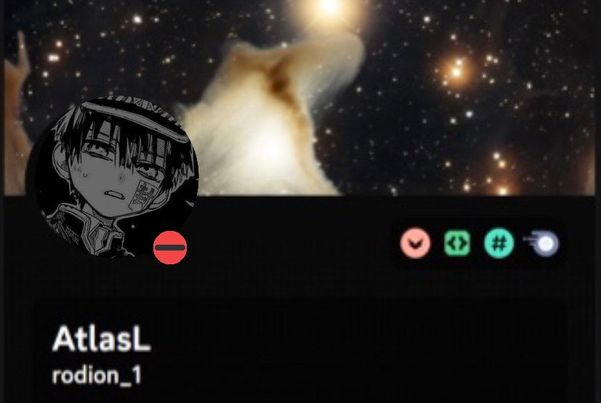

# Hallo! 👋

I'm Atlas, a student with a passion for problem-solving and creating innovative solutions. I have a stronger background in Python compared to other programming languages, such as C++, Java and so on. I'm a big astronomy and AI enthusiast, and I am willing to discuss or talk to anyone with similar interests. Well, not just those interests, I'm always eager to learn and explore new technologies and branches. 

If you're interested in collaborating on exciting projects or discussing ideas, do reach out. I'm always open to new opportunities and connections! 

## My Languages 

## GitHub Statistics

## Discord

### Discord Bots 

I have a few Discord bots too, and they are all constantly under development.

1. Simple Bot, my first ever bot, of which I hope to develop into an AI virtual assistant one day: 
<a href="https://discord.com/api/oauth2/authorize?client_id=1112313592516190298&permissions=8&scope=applications.commands%20bot">Link to Authorisation</a>

2. Fact Bot, who generates random fun facts according to topics: 
<a href="https://discord.com/api/oauth2/authorize?client_id=1118063952216211456&permissions=8&scope=applications.commands%20bot">Link to Authorisation</a>

3. Orbital Navigator, who is under development for more information and astronomy facts: 
<a href="https://discord.com/api/oauth2/authorize?client_id=1119580432191737866&permissions=8&scope=bot%20applications.commands">Link to Authorisation</a>

4. Atomic Navigator, who is under development for more information and biochemistry facts: 
<a href="https://discord.com/api/oauth2/authorize?client_id=1119623208728023081&permissions=8&scope=applications.commands%20bot">Link to Authorisation</a>

5. Inertia Navigator, who is under development for more information and physics facts: 
<a href="https://discord.com/api/oauth2/authorize?client_id=1120339484278538472&permissions=8&scope=applications.commands%20bot">Link to Authorisation</a>

6. Algebraic Navigator, who is under development for more information and maths facts: 
<a href="https://discord.com/api/oauth2/authorize?client_id=1120339535755218944&permissions=8&scope=bot%20applications.commands">Link to Authorisation</a>

### Discord Server 

I also have a Discord server just for bot developers, whether digital or physical ones. No judgement here, we're just amateurs helping each other out, sharing projects and ideas. 

This is the link, if interested: https://discord.gg/pGcEX9G4Yn

### Discord User

Feel free to reach out to me through Discord, by clicking on the image or adding me through my user ID! But first, do clarify that you reached out to me through here. 

