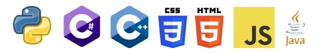
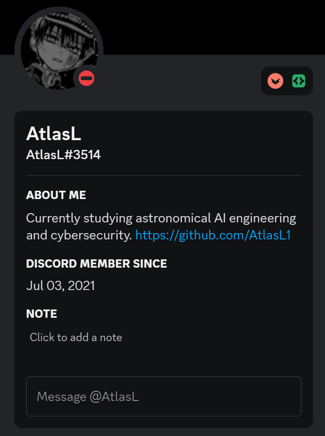

# Hallo! 
I'm Atlas, a student with a passion for problem-solving and creating innovative solutions. I have a stronger background in Python compared to other programming languages, such as C++, Java and so on. I'm a big astronomy and AI enthusiast, and I am willing to discuss or talk to anyone with similar interests. Well, not just those interests, I'm always eager to learn and explore new technologies and branches. 

If you're interested in collaborating on exciting projects or discussing ideas, do reach out. I'm always open to new opportunities and connections! 

## My Languages 

## GitHub Statistics

[]

## Discord

Feel free to reach out to me through Discord, by clicking on the image or adding me through my user ID.

