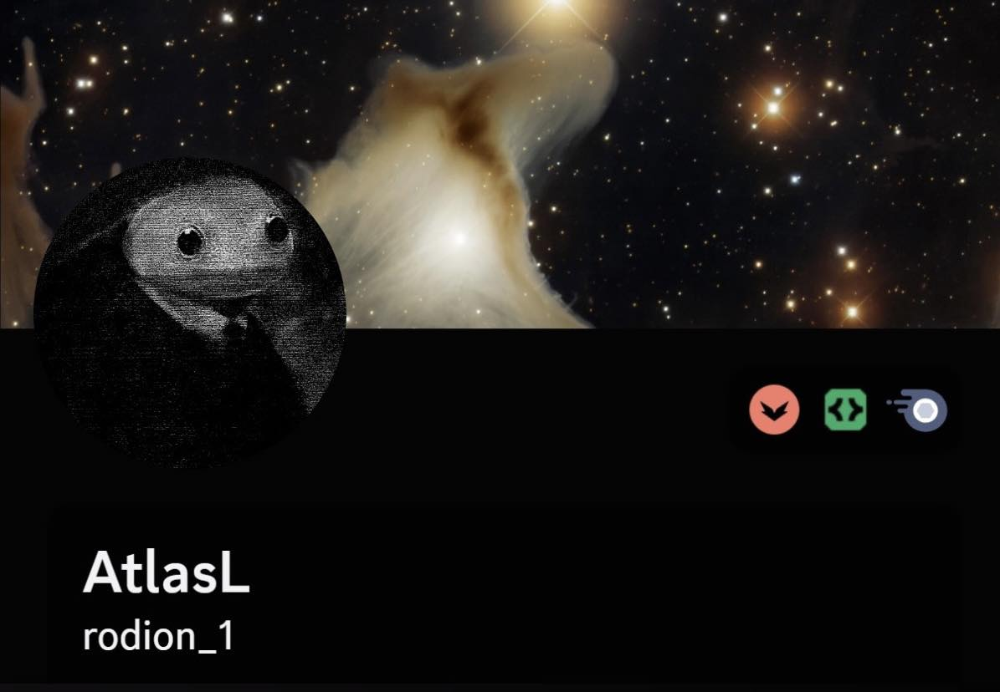

# Hallo! 👋

I'm Atlas, a student with a passion for problem-solving and creating innovative solutions. I have a stronger background in Python compared to other programming languages, such as C++, Java and so on. I'm a big astronomy and AI enthusiast, and I am willing to discuss or talk to anyone with similar interests. Well, not just those interests, I'm always eager to learn and explore new technologies and branches. 

If you're interested in collaborating on exciting projects or discussing ideas, do reach out. I'm always open to new opportunities and connections! 

## My Languages 

## GitHub Statistics

## Discord

### Discord Bots 

Some of these Discord bots were created and developed by me, although unused and unverified:

1. Simple Bot, my first ever bot, of which I hoped to develop into an AI virtual assistant one day: 
<a href="https://discord.com/api/oauth2/authorize?client_id=1112313592516190298&permissions=8&scope=applications.commands%20bot">Link to Authorisation</a>

2. Fact Bot, who generates random fun facts according to topics: 
<a href="https://discord.com/api/oauth2/authorize?client_id=1118063952216211456&permissions=8&scope=applications.commands%20bot">Link to Authorisation</a>

They are only my beginner projects. A bigger and official bot is on the way: Helios. 

### Discord Server 

#### Bots Under Construction
Bots Under Construction is a community for bot developers, whether physical robots or digital ones. Beginners, amateurs, and experts are all welcomed. 

###### A few things about Bots Under Construction:
1. We are looking for more moderators and bot analysers
2. We are more than happy to receive bot adding requests
3. Still a very small community hoping to grow bigger
4. We strive to maintain a healthy community

###### What you can do here:
1. Add your bots
2. Improve or help others in bot developing or programming in general
3. Find people with similar interests
4. Test bots of your own and others' too
5. Get your own channel for your bot (Your bot will be separated from members!)
6. Discuss your ideas or collaborate on projects

This is the link, if interested: https://discord.gg/xASEtwRPta

### Discord User

Feel free to reach out to me through Discord, by clicking on the image or adding me through my username! But first, do clarify that you reached out to me through here. 

<iframe src="https://discord.com/widget?id=1112353759784341614&theme=dark" width="500" height="650" allowtransparency="true" frameborder="0" sandbox="allow-popups allow-popups-to-escape-sandbox allow-same-origin allow-scripts"></iframe>

